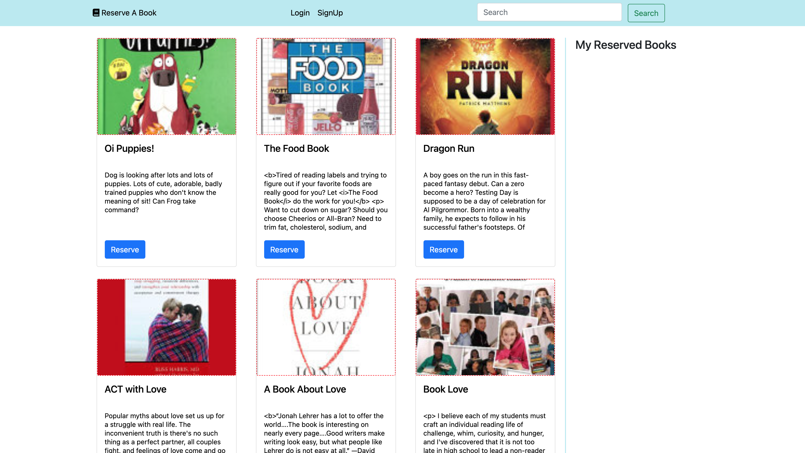
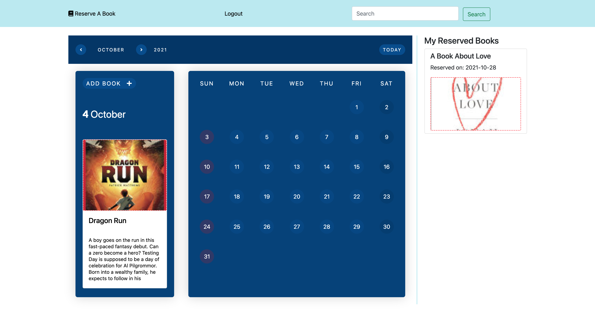

# Reserve-A-Book
Website to view available books at library, and reserve books to be picked up from the counter within a few minutes

## User Story
User logs in and is able to see list of books reserved
User is able to search for book and reserve a date for pickup
Upon returning back to main screen, users can see reserved books on side of screen

## Application Structure
This is to provide detail explanation of the project structure using MVC pattern.

### Models Folder - models
1. Contains classes for mapping to database tables. 

### Routes - routes
1. Definition of url routes for main page and sub directories
2. Api route definitions. 
3. Middleware for connecting the models and views.

### Views - views
1. This is a handlebar ui element builder. [Refer to](https://www.npmjs.com/package/express-handlebars) for more details.

### Public Asset - public/assets
Contains all css, images and javascript used on the client side.

Example of how to include in html `<script src='/assets/login.js'></script>`

## API Endpoints
List of api endpoints used by service. 
1. /api/v1/books [GET, POST]
2. /api/v1/books/:id [GET, PUT]
3. /api/v1/reservations [GET, POST]
4. /api/v1/reservations/:id [GET, PUT, DELETE]
5. /api/v1/users [POST]
6. /api/v1/users/login [POST]

## Database
MySQL database is the choice of db for the project.

## Login Session
When a user make a request to /api/users/login, user id will be saved in session.
If the user make request reserve a book, the user's info in session will be use.

### Session NPM
[`npm i express-session`](https://www.npmjs.com/package/express-session)

## Application Environment Variables
These are required to be set for application to run
Add your database user and password
```
export BR_DB_USER=
export BR_DB_PW=
export BR_DB_NAME=book_reservation_db
export BR_DB_HOST=localhost
export BR_PASSOWRD_SALT_ROUNDS=10
```

## Deploying to Heroku
Install the Heroku CLI
Download and install the Heroku CLI.

If you haven't already, log in to your Heroku account and follow the prompts to create a new SSH public key.

1. `heroku login`
2. `heroku git:remote -a yale-rare-book-reservation`
3. `git checkout master`
4. `git push heroku master`

## Screenshot




## Credits
Sherol Aboagye

## Links
[Heroku URL](https://yale-rare-book-reservation.herokuapp.com)

[Github Repo](https://github.com/saboagye23/Yale-Rare-Book-Reservations.git)
